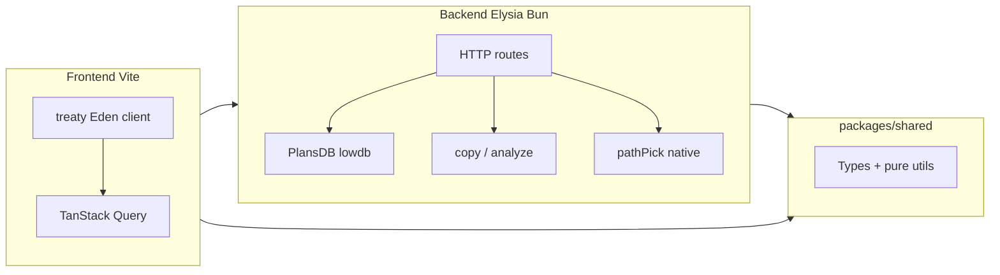

# План: бэкенд, shared и Eden

## Текущее состояние

- **Фронтенд** ([packages/frontend](packages/frontend)): TanStack Start, серверные функции в `[plans.functions.ts](packages/frontend/src/actions/plans.functions.ts)`, `[copy.functions.ts](packages/frontend/src/actions/copy/copy.functions.ts)`, `[pathPick.functions.ts](packages/frontend/src/actions/pathPick/pathPick.functions.ts)`, `[background.functions.ts](packages/frontend/src/actions/background.functions.ts)`. Реализация тянет `[PlansDB`/lowdb](packages/frontend/src/background/db/plans.db.server.ts), `[copy.server.ts](packages/frontend/src/actions/copy/copy.server.ts)` (Node `fs`), `[pathPick.server.ts](packages/frontend/src/actions/pathPick/pathPick.server.ts)` (`popups-file-dialog`). UI: React Query + в части мест `[useServerFn](packages/frontend/src/components/leafs/PlanWindow.tsx)`.
- **Бэкенд** ([packages/backend](packages/backend)): минимальный Elysia, порт из `PORT` / дефолт **3001** (`[index.ts](packages/backend/src/index.ts)`).
- **Уже заложено**: `[VITE_EXTERNAL_BACKEND_URL](packages/frontend/.env)`, типы в `[vite-env.d.ts](packages/frontend/src/vite-env.d.ts)`.

## Целевая архитектура

- **HTTP** — единственный контракт между фронтом и бэкеном; серверные функции Start для бизнес-логики **удаляются** (плагин Start для роутинга/SSR при необходимости можно оставить).
- **Eden (treaty)** — вывод типов маршрутов из `typeof app` на бэкенде; на фронте базовый URL из `import.meta.env.VITE_EXTERNAL_BACKEND_URL`.

## 1. Пакет `packages/shared`

- Инициализировать лёгкий пакет (TypeScript `"module"`, `exports` на `dist` или исходники — по принятому в репо стандарту сборки; минимально: общие `.ts` без React/Node-only).
- **Перенести/реэкспортировать** то, что нужно обоим концам:
  - типы: `Plan` (сейчас `[plans.ts](packages/frontend/src/background/plans/plans.ts)`), `Schedule`, `Time` (`[schedule.ts](packages/frontend/src/lib/scheduler/schedule.ts)`, `[time.ts](packages/frontend/src/lib/scheduler/time.ts)`), `PathInfo`, `PathType`, `FileAutoSize` (`[files.ts](packages/frontend/src/lib/files/files.ts)`), DTO для тел запросов (например `StartCopyData` из `[copy.functions.ts](packages/frontend/src/actions/copy/copy.functions.ts)`), ответ `CopyAnalysis` (сейчас в `[copy.server.ts](packages/frontend/src/actions/copy/copy.server.ts)` — лучше описать в shared как контракт API).
  - **Чистые функции**: `getSizeAutoFromBytes`, `isTime`, `parseTime` (если бэкенд будет валидировать расписание) — без зависимости от DOM/Node.
- **Не тащить в shared**: классы с `Date`/файловой системой (`FileMetaInfo`, `FileIterator`), lowdb, anything из `*.server.ts` — они остаются только в бэкенде (или дублируется только сериализуемый вид в типах).

После этого фронт переключает импорты с `#/background/plans/plans`, `#/lib/files/files` (типы) на `@copymachine/shared` (или выбранное имя scope).

## 2. Монорепозиторий и зависимости

- В [корневой `package.json](package.json)` добавить `**"workspaces": ["packages/*"]`** (или явно `frontend`, `backend`, `shared`), чтобы `npm install` в корне связывал локальные пакеты.
- В [packages/backend/package.json](packages/backend/package.json): зависимость на `shared` (`workspace:*`), `lowdb`, `@elysiajs/cors` (и при необходимости валидация тел — например через встроенные схемы Elysia).
- В [packages/frontend/package.json](packages/frontend/package.json): `shared`, `@elysiajs/eden`.

Имя пакета shared зафиксировать единообразно (например `copymachine-shared`).

## 3. Бэкенд Elysia: маршруты и перенос кода

- Разбить приложение на модули (например `src/routes/plans.ts`, `copy.ts`, `pathPick.ts`, `health.ts`) и собрать в одном `app`.
- **CORS**: разрешить origin фронта (`http://localhost:3000` из `[vite.config.ts](packages/frontend/vite.config.ts)` / env), credentials при необходимости.
- **Планы**: перенести `[PlansDB](packages/frontend/src/background/db/plans.db.server.ts)` и инициализацию каталога данных (сейчас `[db.server.ts](packages/frontend/src/background/db/db.server.ts)` резолвит `data` от `process.cwd()` — на бэкенде это будет `packages/backend/data`.
- **Копирование / анализ**: перенести `[copy.server.ts](packages/frontend/src/actions/copy/copy.server.ts)` и `[files.server.ts](packages/frontend/src/lib/files/files.server.ts)`; типы ответов брать из `shared`; для `getSizeAutoFromBytes` импорт из `shared`.
- **Path picker**: перенести `[pathPick.server.ts](packages/frontend/src/actions/pathPick/pathPick.server.ts)`; зависимость `popups-file-dialog` на бэкенд.
  - **Риск**: нативный аддон может требовать проверки на **Bun**; если не заведётся — варианты: бэкенд на Node для этого модуля или замена диалога позже. Заложить проверку после переноса.
- **Замена `ensureBackgroundServer`**: плейсхолдер `[BackgroundServer](packages/frontend/src/background/background.server.ts)` больше не нужен для оркестрации; достаточно `**GET /health**` (или исходный `/`), который фронт дергает в `useQuery` / начальной мутации в `[routes/index.tsx](packages/frontend/src/routes/index.tsx)`. Условие `enabled` для остальных запросов привязать к успеху health.
- **Экспорт типа для Eden**: после объявления всех групп маршрутов — `export type App = typeof app` из отдельного файла (например `src/app.ts`), который импортируется на фронте **как type-only** (`import type { App } from 'copymachine-backend/app'` **нежелательно** с точки зрения границ пакетов). Практичный вариант для монорепы: общий модуль `packages/backend/src/export-type.ts` или дублирование инференса через `treaty<typeof app>` только на фронте с **path mapping** в tsconfig на исходники бэкенда — обычно проще `**import type { App } from '../../backend/src/app'`** в dev или опубликовать минимальный `@copymachine/backend-types`. Самый простой путь: **фронт в workspace импортирует `type App` из пакета backend** через `package.json` поле `exports` с типами (например `"types": "./src/app.ts"` для внутренней разработки). Зафиксировать в реализации один способ, чтобы Eden получал строгий generic.

## 4. Фронтенд: Eden + React Query

- Создать модуль клиента, например `src/lib/api.ts`:
  - `import { treaty } from '@elysiajs/eden'`
  - `import type { App } from ...` (из бэкенда)
  - `export const api = treaty<App>(import.meta.env.VITE_EXTERNAL_BACKEND_URL)`
- Заменить вызовы:
  - `[PlansList](packages/frontend/src/components/leafs/PlansList.tsx)`: `queryFn` → `api.plans...` (конкретные пути согласовать с группой на Elysia).
  - `[CreatePlanForm](packages/frontend/src/components/leafs/CreatePlanForm.tsx)`, `[PlanWindow](packages/frontend/src/components/leafs/PlanWindow.tsx)`: убрать `useServerFn`, в `mutationFn` вызывать методы Eden; сохранить `invalidateQueries` / ключи по [guides/TanStack.md](guides/TanStack.md).
  - `[index.tsx](packages/frontend/src/routes/index.tsx)`: `getCopyAnalysis`, `startCopy`, health вместо `ensureBackgroundServer`.
  - `[PathPicker](packages/frontend/src/components/PathPicker.tsx)`: `chooseFolder` / `chooseFile` → HTTP POST на бэкенд (через тонкую обёртку над Eden).
- Удалить или опустошить файлы `*.functions.ts`, сервер-only модули из фронта после переноса; **Vite `server.watch.ignored` для `data/`** можно убрать или о оставить только если что-то ещё пишет в корень фронта.

## 5. Документация и DX

- Обновить [guides/TanStack.md](guides/TanStack.md): данные с бэкенда через Eden-клиент внутри `queryFn` / `mutationFn`, без прямых server functions.
- [packages/backend/.env.example](packages/backend/.env.example): `PORT`, при необходимости `CORS_ORIGIN`.
- При необходимости кратко описать в существующем README бэкенда структуру API (без создания новых md, если не просили — можно ограничиться комментариями в коде на русском по правилам репо).

## Порядок работ (рекомендуемый)

1. `shared` + workspaces + переключение импортов типов на фронте (без смены runtime).
2. Реализовать на Elysia маршруты и перенести серверный код; подключить CORS и `App` type export.
3. Подключить Eden на фронте, точечно заменить вызовы, удалить server functions и мёртвый код.
4. Проверка сценариев: список планов, CRUD, анализ копирования, диалоги путей, старт dev из корня (`concurrently` уже есть).

## Зависимости, требующие внимания

| Область                    | Заметка                                                                             |
| -------------------------- | ----------------------------------------------------------------------------------- |
| `popups-file-dialog` + Bun | Проверить сборку/рантайм; запасной план — Node или другая библиотека.               |
| Пути к `data/`             | Явно задать каталог на бэкенде (env `DATA_DIR`), не смешивать с Vite cwd.           |
| Тип `App` для Eden         | Настроить `exports`/tsconfig paths так, чтобы фронт видел тип без циклических deps. |

