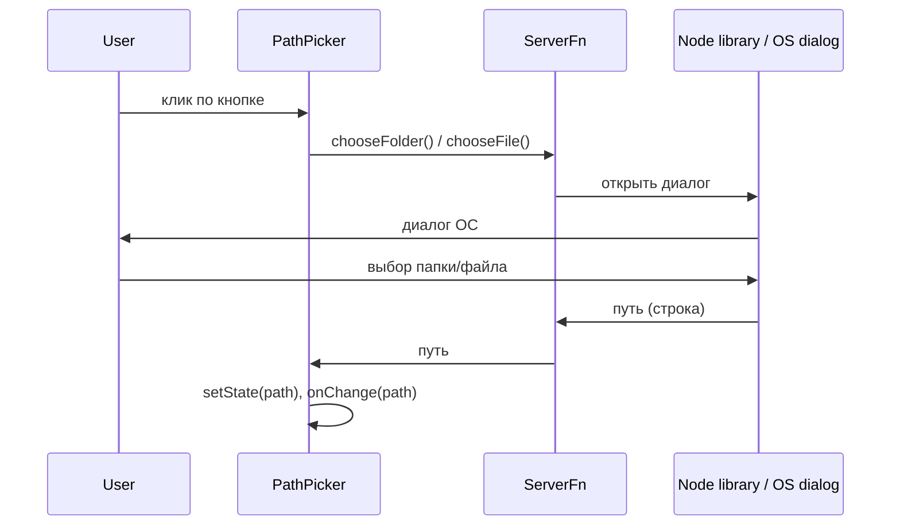

# План: выбор пути через бэкенд и обновление PathPicker

## Архитектура

- **Бэкенд**: серверная функция TanStack Start (`createServerFn`), выполняемая в Node. Вызывает нативный диалог ОС через Node-библиотеку и возвращает полный путь.
- **PathPicker**: по кнопке вызывает эту функцию; отображаемое значение хранится во **внутреннем state** и обновляется сразу после ответа сервера; `onChange` только уведомляет родителя, отрисовка от него не зависит.

---

## 1. Бэкенд: серверная функция выбора папки/файла

- **Где**: новый модуль в `src/` для server functions, например `src/server/pathPicker.ts` или рядом с роутами (по принятой в проекте практике).
- **Что сделать**:
  - Добавить зависимость для нативного диалога в Node. Варианты:
    - **node-file-dialog** — готовый API для папки/файла, возвращает путь.
    - Либо **file-folder-dialogs** (кросс-платформа).
  - Реализовать две server functions через `createServerFn` из `@tanstack/react-start`:
    - `chooseFolder`: открыть диалог выбора папки, вернуть строку с путём (или `null` при отмене).
    - `chooseFile`: то же для файла (при необходимости — опции: один файл, фильтры расширений).
  - В обработчике вызывать выбранную библиотеку (например `dialog({ type: 'directory' })`), обрабатывать отмену и ошибки, возвращать путь или `null`.
- **Ограничение**: диалог показывается на той машине, где запущен сервер. Для локальной разработки и самохостинга на ПК пользователя это подходит; на безголовом сервере вызывать не стоит (документировать).

---

## 2. PathPicker: обновление поля из внутреннего state

- **Файл**: [src/components/PathPicker.tsx](c:\workroot\Разработка\3PlusOffer\copymachine\src\components\PathPicker.tsx).
- **Идея**: отображаемое значение в инпуте задаётся **только внутренним state**; при выборе через бэкенд обновляем этот state и вызываем `onChange`, чтобы родитель мог синхронизировать своё состояние, но перерисовка инпута не зависит от того, как родитель обработал `onChange`.
- **Изменения**:
  1. **Внутренний state**: ввести `const [inputValue, setInputValue] = useState(value)` (или производное имя). Инпут рендерить как `value={inputValue}`, `onChange={(e) => { setInputValue(e.target.value); onChange(e.target.value); }}`.
  2. **Синхронизация с пропом `value`**: в `useEffect` при изменении `value` вызывать `setInputValue(value)`, чтобы при сбросе/инициализации снаружи поле обновлялось.
  3. **Кнопка выбора**: по клику вызывать серверную функцию (`chooseFolder` / `chooseFile`) вместо `window.showDirectoryPicker` / `showOpenFilePicker`. По успешному ответу с путём: `setInputValue(path)` и `onChange(path)`. При отмене/ошибке ничего не менять (или только логировать).
  4. **Удалить**: глобальное расширение `Window` для `showDirectoryPicker` / `showOpenFilePicker` и любой код, использующий браузерный File System Access API в этом компоненте.
- **Пропсы**: оставить `value`, `onChange`, `mode`, `label`, `placeholder`, `disabled`, `className`. При необходимости добавить опциональный `baseUrl` или конфиг для адреса сервера, если в будущем API будет на другом origin (пока не обязательно).

---

## 3. Зависимости и скрипты

- В [package.json](c:\workroot\Разработка\3PlusOffer\copymachine\package.json) добавить выбранную библиотеку (например `node-file-dialog` или `file-folder-dialogs`). Учесть, что часть таких пакетов может требовать сборки нативных модулей (node-gyp) или иметь ограничения по ОС — при выборе проверить поддержку Windows/macOS/Linux.

---

## 4. Родительский пример (index)

- В [src/routes/index.tsx](c:\workroot\Разработка\3PlusOffer\copymachine\src\routes\index.tsx) уже используется PathPicker с `value` и `onChange`. После изменений в PathPicker достаточно хранить путь в state и передавать в `value` (для синхронизации при сбросе/инициализации); при выборе через кнопку значение сначала обновится во внутреннем state PathPicker, затем через `onChange` попадёт в state родителя — дополнительных правок по минимуму.

---

## Порядок реализации

1. Добавить в проект зависимость для нативного диалога (Node).
2. Реализовать server functions `chooseFolder` и `chooseFile` в отдельном модуле.
3. В PathPicker ввести внутренний state для строки в инпуте, синхронизацию с `value` и вызов серверных функций по кнопке; убрать использование браузерного API и глобальный `Window`.
4. При необходимости обновить использование PathPicker на странице (например, index) и проверить сценарии: выбор папки/файла, отмена, ручной ввод, сброс значения родителем через `value`.

